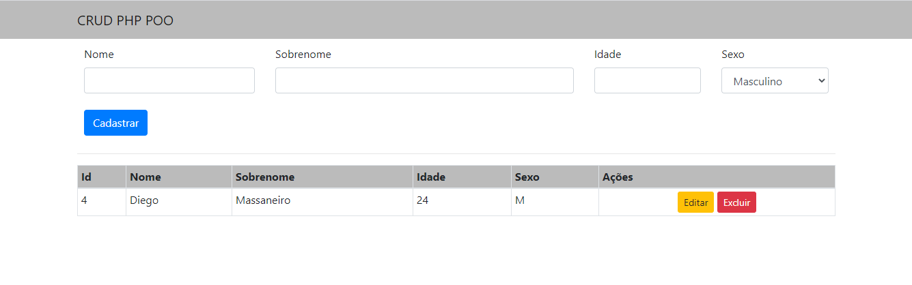

# CRUD Simples Utilizando PHP + MySql + Bootstrap 4
Cadastro Simples de Usuário Utilizando apenas PHP 



Instalação
------------

Criar a tabela no Banco de dados:

```sql
create table usuario(
    id integer primary key AUTO_INCREMENT,
    nome varchar(200) not null,
    sobrenome varchar(300) not null,
    idade integer not null,
    sexo char(1) not null
)
```

Configurar o arquivo Conexao.php dentro da pasta 'app/conexao': <br>

Adicione o codigo abaixo dentro da função getConexão(), caso seu banco seja Mysql ja está como padrão.<br>
Lembre-se de alterar os dados(dbname,user,password) na conexão de acordo com seu banco.

-Conexão para MySql
```php
 if (!isset(self::$instance)) {
           self::$instance = new PDO('mysql:host=localhost;dbname=github', 'root', '', array(PDO::MYSQL_ATTR_INIT_COMMAND => "SET NAMES utf8"));
           self::$instance->setAttribute(PDO::ATTR_ERRMODE, PDO::ERRMODE_EXCEPTION);
           self::$instance->setAttribute(PDO::ATTR_ORACLE_NULLS, PDO::NULL_EMPTY_STRING);
       }

       return self::$instance;
```
-Conexão para PostgreSql

```php
        $host = 'localhost;port=5432';
        $dbname = 'github';
        $user = 'root';
        $pass = '';
        try {
      
            if (!isset(self::$instance)) {
                self::$instance = new \PDO('pgsql:host='.$host.';dbname=' . $dbname . ';options=\'--client_encoding=UTF8\'', $user, $pass);
                self::$instance->setAttribute(\PDO::ATTR_ERRMODE, \PDO::ERRMODE_EXCEPTION);
                self::$instance->setAttribute(\PDO::ATTR_ORACLE_NULLS, \PDO::NULL_EMPTY_STRING);
            }

            return self::$instance;
        } catch (Exception $ex) {
            echo $ex.'<br>';
        }
```

## Créditos
Diego Massaneiro<br>
email: dmassaneiro95@gmail.com
